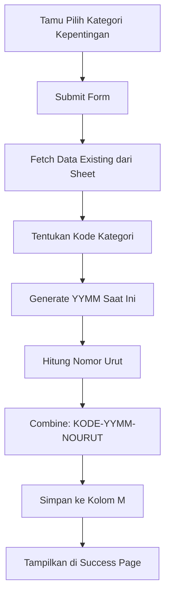

# Dokumentasi: Sistem Nomor Antrian e-Tamu

## 📋 Daftar Isi
1. [Format Nomor Antrian](#format-nomor-antrian)
2. [Cara Kerja](#cara-kerja)
3. [Struktur Sheet](#struktur-sheet)
4. [Fitur Utama](#fitur-utama)
5. [Contoh Penggunaan](#contoh-penggunaan)

---

## Format Nomor Antrian

Format nomor antrian mengikuti pattern: **`KODE-YYMM-NOURUT`**

### Kode Kategori:
| Kategori | Kode | Contoh |
|----------|------|--------|
| **Layanan Perpustakaan** | LP | `LP-2604-001` |
| **Konsultasi Statistik** | KS | `KS-2604-015` |
| **Rekomendasi Statistik (Khusus OPD/Pemda)** | RS | `RS-2604-008` |
| **Lainnya** | L | `L-2604-042` |

### Penjelasan:
- **KODE**: 2 karakter kode kategori
- **YYMM**: Tahun (2 digit) + Bulan (2 digit) → Reset otomatis tiap bulan
  - Contoh: `2604` = Tahun 26, Bulan 04 (April 2026)
- **NOURUT**: Nomor urut 3 digit → Auto-increment per kategori per bulan
  - Dimulai dari `001` setiap awal bulan

---

## Cara Kerja

### 1. **Proses Generate Nomor Antrian**



### 2. **Auto-Reset Bulanan**

- Sistem **otomatis** menggunakan bulan saat ini (`YYMM`)
- Ketika bulan berubah (misal Mei 2026 = `2605`), nomor urut akan reset ke `001`
- Tidak perlu setup manual atau trigger di sheet

### 3. **Counting Nomor Urut**

```javascript
// Pseudocode
if (data sudah ada untuk LP-2604) {
    nomor_terakhir = filter & sort(data, kategori=LP, bulan=2604)
    nomor_baru = nomor_terakhir + 1  // contoh: 001 → 002
} else {
    nomor_baru = 001  // first entry bulan ini
}
```

---

## Struktur Sheet

### Header Row (Row 1)
| A | B | C | D | E | F | G | H | I | J | K | L | **M** |
|---|---|---|---|---|---|---|---|---|---|---|---|-------|
| Waktu | Nama | Asal | No. HP | Kepentingan | Tujuan | HP Tujuan | - | Jenis Kelamin | Email | Umur | Pendidikan | **ANTRIAN** |

### Kolom M (Antrian)
- **Nama Kolom**: ANTRIAN (atau custom sesuai sheet Anda)
- **Tipe Data**: Text
- **Format**: `KODE-YYMM-NOURUT`
- **Contoh Isi**:
  ```
  LP-2604-001
  KS-2604-002
  RS-2604-001
  L-2604-005
  LP-2604-002
  ...
  ```

---

## Fitur Utama

### ✅ Fitur Implementasi

1. **Auto-Generate**
   - Nomor antrian otomatis di-generate saat form submit
   - Tidak perlu input manual

2. **Kategori-Aware**
   - Setiap kategori kepentingan punya kode unik
   - Jika pilih multiple, gunakan kategori pertama

3. **Reset Bulanan**
   - Nomor urut reset ke 001 setiap 1 Mei (atau awal bulan)
   - Format YYMM otomatis sesuai tanggal saat ini

4. **Unique Counting**
   - Setiap kombinasi `KODE-YYMM` memiliki counter terpisah
   - Contoh: LP-2604 bisa sampai LP-2604-100, KS-2604 mulai dari KS-2604-001

5. **Visual Display**
   - Nomor antrian ditampilkan prominent di success page
   - Font besar, styling menonjol untuk mudah dilihat

---

## Contoh Penggunaan

### Scenario: Tamu Hari Pertama Bulan Ini

**Tanggal**: 1 April 2026 (2604)

#### Tamu 1: Layanan Perpustakaan
```
Form Input:
- Nama: Budi
- Kategori: Layanan Perpustakaan

Generated: LP-2604-001
Sheet: [..., "LP-2604-001"]

Success Page:
┌─────────────────────┐
│ Nomor Antrian Anda  │
│   LP-2604-001       │
│ Silakan tunjukkan   │
│ nomor ini ke petugas│
└─────────────────────┘
```

#### Tamu 2: Konsultasi Statistik
```
Form Input:
- Nama: Andi
- Kategori: Konsultasi Statistik

Generated: KS-2604-001
Sheet: [..., "KS-2604-001"]

Success Page:
┌─────────────────────┐
│ Nomor Antrian Anda  │
│   KS-2604-001       │
│ Silakan tunjukkan   │
│ nomor ini ke petugas│
└─────────────────────┘
```

#### Tamu 3: Layanan Perpustakaan (lagi)
```
Form Input:
- Nama: Citra
- Kategori: Layanan Perpustakaan

Generated: LP-2604-002 ← Auto increment!
Sheet: [..., "LP-2604-002"]

Success Page:
┌─────────────────────┐
│ Nomor Antrian Anda  │
│   LP-2604-002       │
│ Silakan tunjukkan   │
│ nomor ini ke petugas│
└─────────────────────┘
```

---

## File-File Terkait

### 1. **`src/utils/generateAntrianNumber.ts`**
Utility functions untuk generate nomor antrian:
- `generateAntrianNumber()` - Main function
- `isValidAntrianFormat()` - Validasi format
- `ANTRIAN_KODE` - Mapping kode kategori

### 2. **`src/pages/ETamu.tsx`**
React component e-Tamu yang sudah diupdate:
- State: `existingAntrianData`, `generatedAntrian`
- Effect: Fetch data existing saat mount
- Handler: `handleSubmit` generate & simpan antrian
- UI: Display nomor antrian di success page

---

## Testing & Verifikasi

### ✓ Cek di Google Sheet
1. Buka sheet e-Tamu Anda
2. Lihat kolom M (ANTRIAN)
3. Pastikan format data:
   ```
   LP-2604-001
   KS-2604-002
   RS-2604-001
   L-2604-005
   LP-2604-002
   ```

### ✓ Testing Scenario
1. **Test 1**: Multiple tamu kategori sama → nomor urut increment
2. **Test 2**: Ganti kategori → kode berubah, urut reset
3. **Test 3**: Bulan baru (May) → format berubah menjadi 2605, urut reset ke 001

### ✓ Troubleshooting
| Masalah | Penyebab | Solusi |
|---------|----------|--------|
| Nomor tidak ter-generate | Data existing tidak ter-fetch | Check Google Sheets API |
| Nomor duplikat | Data existing ada yang berformat berbeda | Cleanup sheet kolom M |
| Format salah | Kode kategori tidak sesuai | Check mapping di `ANTRIAN_KODE` |

---

## Maintenance

### Update Format (Jika Diperlukan)
Edit file `src/utils/generateAntrianNumber.ts`:
```typescript
export const ANTRIAN_KODE: AntrianMapping = {
  perpustakaan: "LP",      // ← ubah di sini
  konsultasi: "KS",
  rekomendasi: "RS",
  lainnya: "L",
};
```

### Tambah Kategori Baru
1. Tambahkan option di `KEPENTINGAN_OPTIONS` di ETamu.tsx
2. Tambahkan mapping di `ANTRIAN_KODE` di generateAntrianNumber.ts

---

## 🎯 Ringkasan

✅ **Nomor antrian di-generate otomatis** berdasarkan:
- Kategori kepentingan (kode fixed)
- Bulan/tahun saat ini (reset bulanan)
- Counter per kategori per bulan (auto-increment)

✅ **Format**: `KODE-YYMM-NOURUT`
- Contoh: `LP-2604-001`, `KS-2604-015`, dsb

✅ **Tersimpan di kolom M** Google Sheet e-Tamu

✅ **Ditampilkan prominent** di success page

---

**Last Updated**: April 27, 2026
**Version**: 1.0
